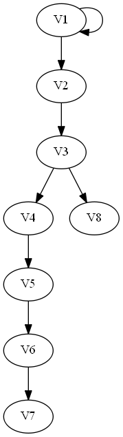
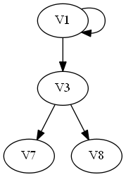
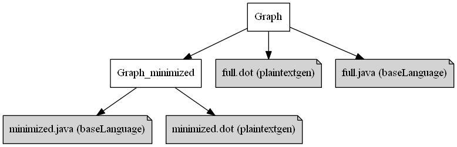

# MPS Power Users NL generator discussion example: granularity of control

This repository describes some example uses of MPS generators for discussion with JetBrains about the design of MPS' generator aspect.

The theme of our examples is multi-target generation and granularity of control in the MPS generators.

We have one example-language to illustrate all the example uses. You can open the language in MPS 2018.3 by opening the folder of this repository when you have cloned it to your machine. Since the example uses plaintextgen, you will also need to add the [MPS Extensions](https://github.com/JetBrains/MPS-extensions/releases/download/nightly-2018.3.691.7da2f8e/de.itemis.mps.extensions-2018.3.691.7da2f8e.zip) to your project libraries or your global libraries (unzip and then add to libraries; note that in 2018.3 you may need to reboot MPS after adding MPS Extensions to your libraries).

Please note that the example repository is not complete. It is merely to have a concrete example language to talk about and the initial plaintextgen generator as a context for the considerations in this README.md document.

## Context
Graph: a language with vertices that can have a color and edges between them.

An example of such a graph is:

We are interested in the "full" version of the graph, but also a "minimized" version that reduces paths (vertices with one input and one output are filtered out).

An example of a minimized graph can be found here:

Additionally to the minimization of the graph, we are interested in two targets: A graphviz `.dot` file, and `.java` files containing code representing the graphs.

## Practical Considerations
### One-target generation
When making a generator for `full.dot`, we can simply write 1 root mapping rule with a `TextgenText` root template from the plaintextgen language. We may or may not want to introduce reduction rules (partially for convenience, more important for extensibility of the generator).

### Multi-target generation
To add generation for `full.java`, we can write a root mapping rule with a `ClassConcept` root template. However, then we need to find a way keep the reduction rules for plaintexten and baseLanguage separate, so they don't interfere with each other. One way (with its obvious drawbacks for understandability and maintainability) would be to write conditions in every reduction rule that are geared towards one generation target or the other. Another way to sort this out is to split the generators for plaintextgen target and for baseLanguage target into separate languages (with their own root nodes) and adding a pre-processing script that makes two separate models, each of which will run their own generation session. This option looks like a pattern that is often repeated for these types of cases, and thus it would be very useful to add first-class support for it in MPS.

### In-model subtree "rewrite"
For the minimization of `Graph` to `Graph_minimized`, we would like to only add a reduction rule to filter vertices and reconnect where vertices have been filtered out. Filtering could be done with a reduction rule and reconnecting with a weaving rule, but first we would need fine-grained control over these rules and second, the original idea of "minimization" gets lost conceptually for maintainers because it is spread over two separate constructs in the generator without an obvious connection between them.

## Ideas/suggestions
* Explicit control over multi-step reduction: Would it be a good idea to have more fine-grained optional control of priorities? E.g. always prefer rule A over rule B (right now you can only do it on language-level).
* Explicit control over mapping configurations: Would it be a good idea to use individual mapping configurations in generator priorities/plans, and not only full languages (allow more fine-grained control)?
* Would it be a good idea to have more fine-grained control over root-nodes of a model in generator priorities/plans? I.e. right now you can only have control on model-level.
* Would it be a good idea to just "draw a graph of dependencies between various inputs/outputs (models, nodes, ...) and transformations (languages/generators, (root mapping/reduction) rules)? This would be how we as language engineers think about model-to-model transformations.

## Conceptual considerations
* Is the "generator always belongs to a language" axiom an obvious/"logical" one? It forces you to sometimes have languages that are empty, except for the generator aspect. Many users coming from Eclipse have different expectations here (concrete example: the Epsilon generators which are part of the Eclipse Modeling Project have the generators as a separate module from a user perspective). It may be useful to make this more easily accessible on the user-level for users of such existing generator frameworks. This also has to do with the fourth idea/suggestion.
* For each of the problems posed, there is a point-solution that will give direct alleviation. However, combining all the solution in one, will be difficult to understand and challenging to maintain. Probably we are missing some additional abstractions.
